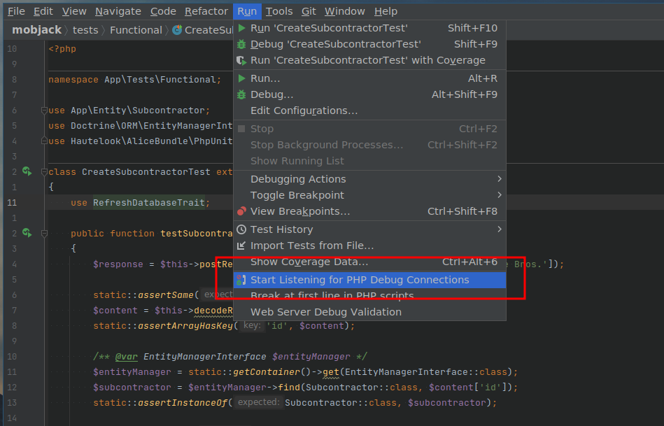
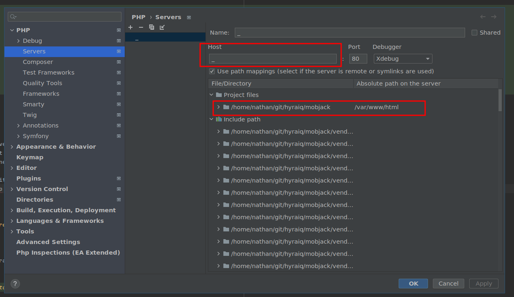
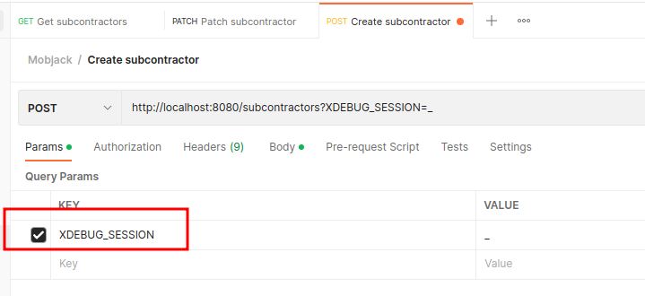
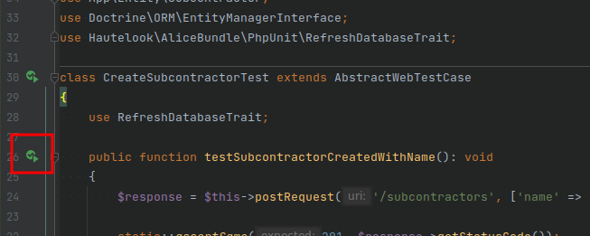
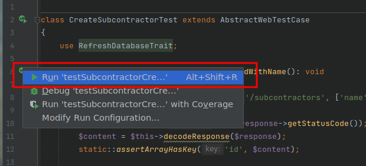
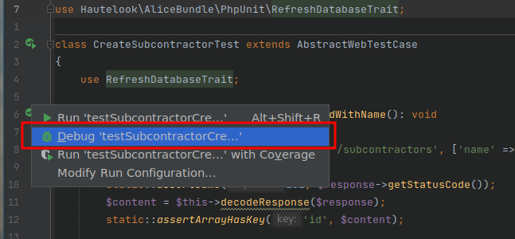

# mobjack


Backend technical challenge for ProcurePro

## Overview

This challenge is designed to accomplish three things:

1. Give you a basic understanding of our tools, domain and how we write code
2. Give us an understanding of how you work and if you'll be comfortable in our stack
3. Give us both something to discuss in the next interview

### Expectations

While we would love you to do a great job of this challenge, we are certainly mindful and respectful of your time. You
should only spend an hour or two on this challenge. It's ok if you don't finish all the tasks. We can both still get
a good understanding of each other, and it will definitely give us something to discuss in the interview.

We are not trying to test your knowledge of PHP or Symfony. We've provided a project that's ready to go, with plenty
of examples for what is required. Additionally, anything PHP/Symfony specific will be easily found on Google, they have
excellent documentation.

Depending on your seniority, we will be looking for different things. 

For a junior we're looking for the attitude you approach the problem with. Do you have a growth mindset? How do you 
understand and break down a problem? What do you google? How do you ask questions?

For a more senior engineer, we'll be looking at how you architect the solution. What trade-offs do you make and why?
How would you expand or improve this given more time?

For everyone, we would expect you to blend into our existing code style, write tests, and attempt to satisfy the static
analysis (we know this can be hard!).

### Our concepts

We love type safety and tests. Our main goal when we write tests is to be certain that the code not only works correctly
now, but also continues to work correctly in the future even though we are constantly changing and refactoring.

Our controllers rely heavily on "models" or [Data Transfer Objects](https://en.wikipedia.org/wiki/Data_transfer_object).
These models are plain PHP objects which give us very good type safety and request validation. We utilize the 
[Symfony Serializer component](https://symfony.com/doc/current/components/serializer.html) to easily and safely parse a
request body into a model.

Controllers are tested with "Functional tests", which load database fixtures and execute a HTTP request. We then assert
that the database has been modified as expected. Functional tests are, by far, the most common test we have. They make
it easy to know that they entire endpoint is working correctly. 

We utilize a [functional core, imperative shell](https://www.kennethlange.com/functional-core-imperative-shell/) pattern.
Any hairy business logic (eg. financial calculations, permission checks, etc) belongs in the "functional core", meaning
that it follows functional programming principals (ie. takes parameters and returns a result with no 
[side-effects](https://softwareengineering.stackexchange.com/q/15269/271775)). This allows us to very heavily unit test
the functional core since it has a small scope and does not require mocking. By Combining heavy unit tests on the hairy 
logic and a couple of functional tests on the endpoint, you can be very sure that everything is working as expected.

TODO: talk about psalm

## Background

ProcurePro is a procurement solution for commercial builders. Imagine you're building a hotel, school or hospital; you
don't do all the work yourself. Instead, you will engage many subcontractors to do the work for you (eg. earthworks,
plumbers, electricians, etc). In order to find the best subcontractor for the job, you run a tender process and receive
a number of different quotes. Now you put these quotes into a "trade comparison" to help you compare each one.

Each subcontractor on a trade comparison will have a name and few pieces of financial information that you can use to 
calculate the "final cost" of this particular subbie.

1. Price -> this is the price the subbie quotes you to do the work
2. Discount -> any discount that you are able to negotiate with the subbie (eg. "mates rates")
3. Adjustment -> price adjustments you need to account for (eg. changes to the design or materials, etc.)
4. Unlet cost -> ancillary costs you are expecting to spend (eg. items the subbie has excluded, contingencies, etc.)

Using these four financial figures, you can now calculate the "final cost" for the subcontractor:

```
final cost = price - discount + adjustment + unlet cost
```

## Tasks

In order to complete this challenge, we have provided you with the following:

- A single database entity ([Subcontractor](./src/Entity/Subcontractor.php)), containing the properties specified above
- A completed endpoint to create a subcontractor ([CreateSubcontractorController](./src/Controller/CreateSubcontractorController.php))
- A completed functional test for the create subcontractor endpoint ([CreateSubcontractorTest](./tests/Functional/CreateSubcontractorTest.php))
- A failing functional test for a missing patch subcontractor endpoint ([PatchSubcontractorTest](./tests/Functional/PatchSubcontractorTest.php))
- An empty core function for calculating the final cost ([FinalCost](./src/Core/FinalCost.php))
- A failing unit test for the FinalCost core function ([FinalCostTest](./tests/Unit/FinalCostTest.php))

There are three separate tasks for you to complete:

1. Create an endpoint to PATCH a Subcontractor
   TODO: more details
2. Implement the `App\Core\FinalCost` core function
   TODO: more details
3. Create an endpoint to list all Subcontractors
   TODO: more details

## Prerequisites

1. [Install Docker](https://docs.docker.com/engine/install/)
2. Fork this repo (please do so in a private repository, they're free now!)
3. Choose a code editor 
   - We recommend the [PhpStorm EAP](https://www.jetbrains.com/phpstorm/nextversion/)
   - It's free, and we share configuration in this repository to get you up and running quickly
   - But feel free to use whatever you're comfortable with
4. (optional) [Install Postman](https://learning.postman.com/docs/getting-started/installation-and-updates/) to easily test the API manually

## Setup

To get setup and ready to go, run the following commands in the root of the repository.

```shell
# Build the necessary docker containers
# It might take a few minutes, so grab a coffee (or a beer, it's 5 o'clock somewhere!)
$ docker composer build

# Start the docker containers so that you can access the environment
$ docker compose up

# Create the database (but not the schema)
$ docker compose run make create-db

# Run the database migrations to create the schema
$ docker compose run make migrate

# Load some fixtures into the database so that you have something to play with
$ docker compose run php make fixtures

# Create the test database and schema (fixtures are loaded and refreshed automatically for tests)
$ docker compose run make test-db
```

You can now access the application at <http://localhost:8080>!

## Usage

### CLI

```shell
# Get into interactive PHP
$ docker compose run php

# Get a shell into a PHP container
$ docker compose run php sh

# Run the entire test suite
$ docker compose run make test

# Run Psalm static analysis
$ docker compose run make psalm
```

### Xdebug

Xdebug is configured to connect to your IDE over port 9000. Once you set a breakpoint, you will probably have to:
1. Enable xdebug in your IDE (tell it to start listening for connections)
   
2. Set the XDEBUG_SESSION GET parameter (not necessary for tests)

Now you should be able to run the code with either PhpUnit or by hitting an endpoint. At this point, your IDE might 
ask you to setup path mappings or servers. You need to map the repository root to `/var/www/html`. This is how it's
configured in PhpStorm:



See the following sections for more details on using Xdebug.

### Postman

To get started quickly you can import the [Mobjack Postman collection](./resources/postman.json) by following
[this guide](https://learning.postman.com/docs/getting-started/importing-and-exporting-data/).

The Postman collection contains endpoints to create, patch and list subcontractors. You can easily tweak the request
data to manually test your implementation.

If you want to use Xdebug with Postman, you can enable the XDEBUG_SESSION GET parameter on each request:



### PhpStorm

TODO: how to configure the interpreter, test framework and database access

PhpStorm allows you to run individual tests easily. Just open a PhpUnit test, click the green "play" button on the left
hand side, then choose the "Run ..." option.




If you want to use Xdebug, choose the "Debug ..." option.


